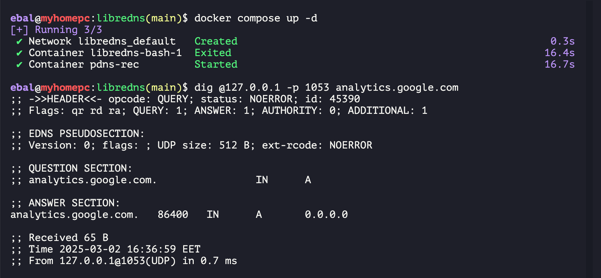

# libredns in a box

* work in progress - not ready !

This code repository wants to provide a libredns (kind of) quick solution for self-hosted environments. 

This specific repo, uses [OpenNic](https://opennic.org/) and [StevenBlack](https://github.com/StevenBlack/hosts) default blacklisting.

## docker compose

Two step process:

1. Get All files
2. Run PowerDNS Recursor

```yaml
---
services:
  bash:
    image: bash
    env_file:
      - path: ./default.env
        required: true
    command: >
      bash -c "mkdir -p recursor.d && cd recursor.d
      && apk add -q curl bind-tools
      && curl -sO https://raw.githubusercontent.com/ebal/libredns-docker/refs/heads/main/get_files.sh
      && bash get_files.sh"
    working_dir: /tmp
    volumes:
      - ./:/tmp
    healthcheck:
      test: ["CMD", "test", "-f", "/tmp/OpenNIC"]
      interval: 10s
      timeout: 5s
      retries: 5
      start_period: 5s

  pdns-rec:
    image: powerdns/pdns-recursor-52
    hostname: pdns-rec
    container_name: pdns-rec
    depends_on:
      bash:
        condition: service_completed_successfully
    env_file:
      - path: ./default.env
        required: true
    ports:
      - "1053:53/udp"
    volumes:
      - ./recursor.d:/etc/powerdns/recursor.d:ro

```

## Demo

With docker compose up and down, you can also make the update on blacklist files.

```bash
docker compose up -d
```
takes a little time to start ... black host file is huge ! 

### test it

with

```bash
dig @127.0.0.1 -p 1053 analytics.google.com
```

output should be something like:

```
analytics.google.com.   86400   IN      A       0.0.0.0
```

## full demo


